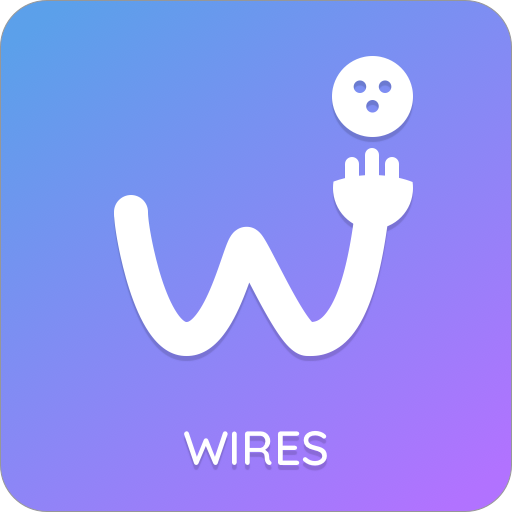

**Wires** is a simple *binding* library for frameworks that doesn't have built-in mecanisms. Many choices have been made to have a restrictive base API. A wide set of extensions are also packaged for Xamarin.iOS and Xamarin.Android.

## Why ?

Several other solutions exist, but I've experienced a **lot** of memory issues with these : that's why I've decided to initiate my own binding library.

## Install

Available on NuGet

[](https://www.nuget.org/packages/Wires/)

## Quickstart

### iOS

To bind data to components with extensions, simply use those fluent APIs :

```csharp
this.ViewModel
		    .Bind(this.label)
		    	.Text(vm => vm.Title, Converters.Uppercase)
			.Bind(this.field)
		    	.Text(vm => vm.Title)
			.Bind(this.image)
		    	.ImageAsync(vm => vm.Illustration)
		    	.Alpha(vm => vm.Amount)
		    	.Visible(vm => vm.IsActive)
			.Bind(this.toggleSwitch)
		    	.On(vm => vm.IsActive)
			.Bind(this.slider)
		    	.Value(vm => vm.Amount)
			.Bind(this.datePicker)
		    	.Date(vm => vm.Birthday)
			.Bind(this.progressView)
		    	.Progress(vm => vm.Amount)
			.Bind(this.activityIndicator)
		    	.IsAnimating(vm => vm.IsLoading)
			.Bind(this.segmented)
		    	.Titles(vm => vm.Sections)
			.Bind(this.button)
		    	.TouchUpInside(vm => vm.LoadCommand);
```

Value converters can also be used with an `IConverter<TSource,TTarget>` implementation, or a lambda expression :

```csharp
this.ViewModel
		.Bind(this.label)
			.TextColor(vm => vm.IsValid, new RelayConverter<bool,UIColor>(x => x ? UIColor.Green : UIColor.Red));
```

## Bindings

### Build-in extensions

#### iOS

* **UIView**
  * `Visible` *bool*
  * `Hidden` *bool*
  * `TintColor` *UIColor*
  * `BackgroundColor` *UIColor*
  * `Alpha` *nfloat*
* **UIActivityIndicator**
  * `IsAnimating` *bool*
* **UIButton**
  * `TouchUpInside` *ICommand*
  * `Title` *string*
  * `Image` *UIImage*
* **UIDatePicker**
  * `Date` *DateTime*
* **UIProgressView**
  * `Progress` *double*
  * `ProgressTintColor` *UIColor*
  * `TrackTintColor` *UIColor*
* **UIImageView**
  * `Image` *UIImage*
  * `ImageAsync` *UIImage*
* **UILabel**
  * `Text` *string*
  * `TextColor` *UIColor*
* **UISegmentedControl**
  * `Titles` *string[]*
  * `Selected` *int*
* **UISlider**
  * `Value` *float*
  * `MaxValue` *float*
  * `MinValue` *float*
* **UIStepper**
  * `Value` *double*
  * `MaximumValue` *double*
  * `MinimumValue` *double*
* **UISwitch**
  * `On` *bool*
* **UITextField**
  * `Text` *string*
* **UIViewController**
  * `Title` *string*
  * `BackTitle` *string*
* **UIWebView / WKWebView**
  * `HtmlContent` *string*

### Basic APIs

**Wires** provides more basic APIs on which are based all the extensions.

```csharp
this.ViewModel.Bind(custom).Property(vm => vm.Source, x => x.Target);
this.ViewModel.Bind(custom).Property<TSourceType, TTargetType, EventArgs>(vm => vm.Source, x => x.Value, nameof(Custom.ValueChanged));
```

You also observe a property with `ObserveProperty` : the given action will be invoked and again each time the property changes.

```csharp
this.ViewModel.Bind(this.label).ObserveProperty(vm => vm.Title, (vm,label,title) => { label.Text = title; });
```


For more advanced options see `Binder<TSource,TTarget>` APIs, or simply take a look at provided extensions to create your own ones.

## Built-in converters

### Implicits

If no converter is given, an default one will be chosen from the registered ones (with `Converters.Register<TSource,TTarget>(converter)`).

* **Shared**
  * `<float, double>` : casting value
  * `<double, float>` : casting value
  * `<long, DateTime>` : from a millisecond timestamp to a datetime.
* **iOS**
  * `<int,nint>` : casting value
  * `<uint,nuint>` : casting value
  * `<float,nfloat>` : casting value
  * `<double,nfloat>` : casting value
  * `<int,nfloat>` : casting value
  * `<DateTime,NSDate>` : from managed type to native one
  * `<int,UIColor>` : an hexadecimal raw value from `0xAARRGGBB` to a native color
  * `<string,UIColor>` : an hexadecimal text value from `"#AARRGGBB"` to a native color
  * `<string,UIImage>` : from a bundle image name to an image instance

### Explicit

Specific converter can be used when binding, a several common converters are available.

* **Shared**
  * `Converters.Identity<T>()` :  creates a `IConverter<T,T>` that returns the given value in both ways.
  * `Converters.Invert` :  a `IConverter<bool,bool>` that inverts the given boolean value.
  * `Converters.Uppercase` :  a `IConverter<string,string>` that change the given string to uppercase.
  * `Converters.Lowercase` :  a `IConverter<string,string>` that change the given string to lowercase.
  * `new RelayConverter<TSource,TTarget>(...)` : an easy way to implement a converter from lambdas.
* **iOS**
  * `PlatformConverters.AsyncStringToCachedImage(TimeSpan expiration)` : at first request ,downloads image from http location and stores it into local storage. The next times (until the expiration date is reached), the cached image will be returned.

## Built-in sources

Wires provides also common helpers for binding simple collection sources to `UITableView`*(iOS)*, `UICollectionView`*(iOS)* and `RecycleView`*(Android)*.

You can first describe your `CollectionSource<TViewModel>` from your shared code.

```csharp
new CollectionSource<RedditViewModel>(this).WithSections("cell", "header", vm => vm.Items, (item) => item.Status, null);
```

```csharp
new CollectionSource<RedditViewModel>(this)
		.WithSection()
			.WithHeader("header", vm => "Section 1")
			.WithCells("cell", vm => vm.Items1 );
		.WithSection()
			.WithHeader("header", vm => "Section 2")
			.WithCell("cell", vm => vm.Item21 )
			.WithCell("cell", vm => vm.Item22 )
			.WithCells("cell", vm => vm.Items23to26 )
			.WithCell("cell", vm => vm.Item27 )
			.WithFooter("footer", vm => "End");
```

And then bind it like any other property with the view extensions on iOS.

```csharp
this.ViewModel
			.Bind(this.tableView)
				.Source(vm => vm.Items, (vm,v,c) =>
					{
						c.RegisterCellView<PostTableCell>("cell", 44);
						c.RegisterHeaderView<PostTableHeader>("header", 88);
					});
```

Its the same for Android!

```csharp
this.ViewModel
			.Bind(this.recyclerview)
				.Source(vm => vm.Items, (vm,v,c) =>
					{
						c.RegisterCellView<PostCellViewHolder>("cell", 44);
						c.RegisterHeaderView<PostHeaderViewHolder>("header", 88);
					});
```

Be sure that your `UITableViewCell` and `RecyclerView.ViewHolder` are implementing `Wires.IView` and update the view on `ViewModel` setter view. Your `RecyclerView.ViewHolder` should also have only one constructor with a `ViewGroup` as only input parameter.

Take a look at samples to see it in action.

## Unbinding

In most cases, you don't have to worry about unbinding because **Wires** purges all bindings regulary if sources of targets have been garbage collected.

But if you reuse a view, and want to update bindings you have to remove the previous bindings before. It is a common with recycling collection patterns (UITableViews, UICollectionViews, Adapters).

This is available through `Unbind(this TSsource, params object[] targets)` extension.

```csharp
this.viewmodel.Unbind(label, this.image, this.title)
```

You can also use `Rebind` method to unbind just before binding.

```csharp
this.ViewModel.Rebind(this.label).Text(v => v.Title)
```

## WeakEventHandlers

If you want to observe an event without keeping a strong reference to your subscriber, use a `WeakEventHandler` instead. You don't have to worry about unscription anymore in most cases!

```csharp
public override void ViewDidLoad()
{
	base.ViewDidLoad();
	this.ViewModel = new RedditViewModel();
	this.ViewModel.AddWeakHandler<PropertyChangedEventArgs>(nameof(INotifyPropertyChanged.PropertyChanged), this.OnViewModelPropertyChanged);
}

private void OnViewModelPropertyChanged(object sender, PropertyChangedEventArgs args)
{
	if(args == nameof(this.ViewModel.Title)
	{
	  // ...
	}
}
```

## Roadmap / Ideas

* Improve architecture
* Improve tests
* Android extensions
* Dynamic sources with collection changes
* Cleaner code
* More documentation
* Trottling functiunalities
* Command parameters

### Contributions

Contributions are welcome! If you find a bug please report it and if you want a feature please report it.

If you want to contribute code please file an issue and create a branch off of the current dev branch and file a pull request.

### License

MIT © [Aloïs Deniel](http://aloisdeniel.github.io)